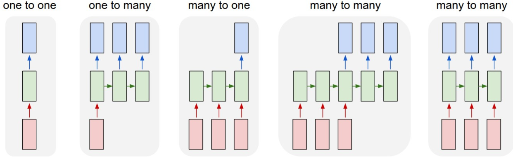
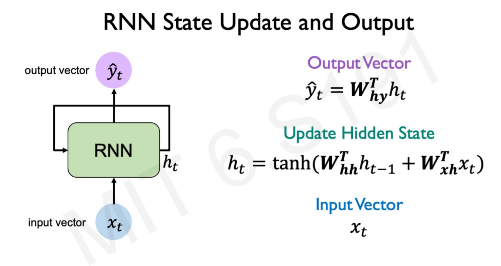
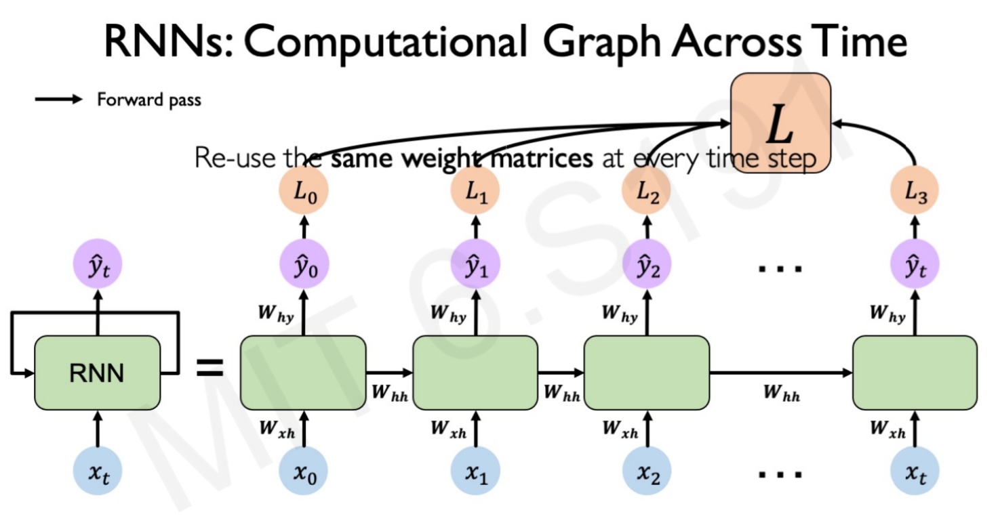
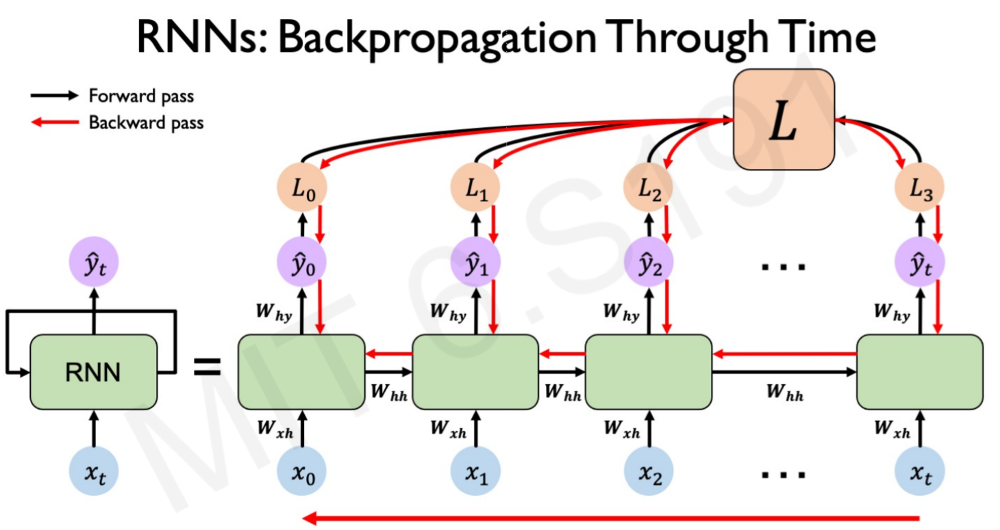
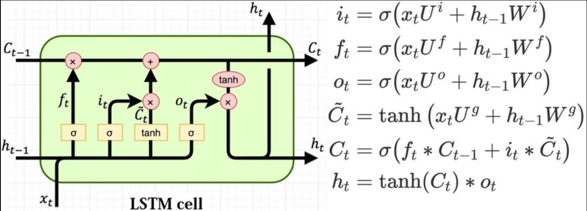
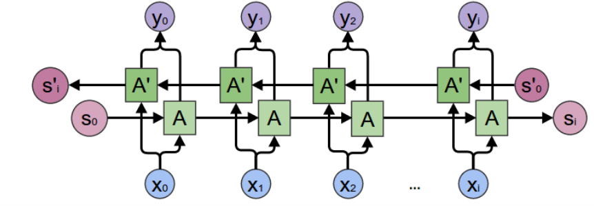
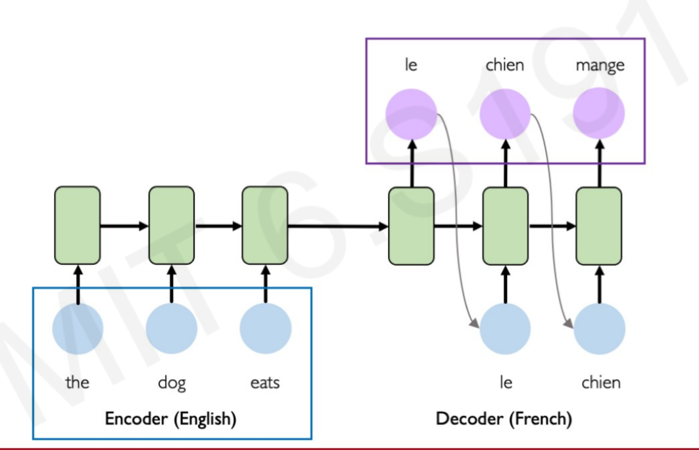
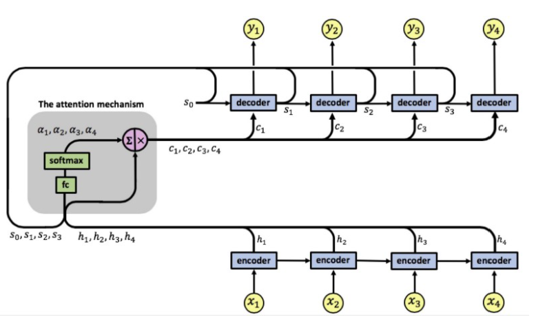
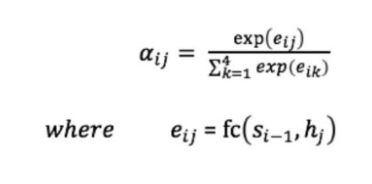

# O que é uma RNN?

Uma Recurrent neural network (RNN) é uma arquitetura de Rede Neural que processa dados sequenciais, como palavra por palavra em uma frase ou informações através do tempo.

Algo notável na RNN, que o tamanho do vetor de entrada é independente, não precisando ter um tamanho fixo para poder rodar a rede.

# Tipos de arquitetura

Os tipos de arquitetura são como abaixo, no qual a 'one to one' seria uma rede neural padrão, por exemplo, o exemplo da classificação de dígitos. Na 'one to many', um exemplo seria uma imagem como input, e output uma serie de palavras. Para a 'many to one', uma sequência de palavras como input e o output podendo ser o sentimento da frase. Numa arquitetura 'many to many', um exemplo seria tradução de texto.

# Por dentro da RNN

Uma RNN é uma Rede neural normal no qual processa a informação através do tempo, assim, para poder interpretar os valores conforme passa o tempo $t$, a camada oculta $h$ passa as informações dadas da $h_{t-1}$ para a $h_{t}$, assim obtendo uma recorrência nos valores.

Em uma célula de RNN, as matrizes $W_{xh},\;W_{hh},\;W_{hy}$ **são as mesmas** conforme passa o tempo $t$.

Os neurônios de ativação podem ser quaisquer, mas o mais usado em uma RNN é a RELU para contrapor um dos problemas das RNNs, pois a derivada para valores positivos é 1, enquanto as derivadas de funções como a tangente hiperbólica e a sigmoide vão para 0.

## Feedfoward

Na fase de propagar a informação, o input é passado, e dependendo da arquitetura, a predição em $\hat{y}_0$ é somada para todas suas propagações no tempo $t$. No qual a camada escondida propaga a informação de $h_0$ até $h_t$ sob a mesma matriz $W_{hh}$.

## Backpropagation

Na fase de atualizar os pesos destas matrizes, há grandes problemas, se há uma sequência muito longa de $h_t$, os pesos vão sendo multiplicados com base no tempo, ou seja, o mesmo valor vai ser multiplicado $t$ vezes.

Se os valores forem **maiores que 1**, acaba produzindo a **explosão do gradiente**, que pode ser contornada com uma solução de "cortar o valor", reduzindo de fato numericamente o valor do gradiente para evitar isso.

Se os valores forem **menores que 1**, produz o **desaparecimento do gradiente**, não obtendo valores que façam aprender de fato, para contornar isso, há 3 formas úteis.

Este problema chamamos de **Long-Term Dependencies**, onde há uma dependência de tempo, no qual a rede precisa de vários inputs ao longo do tempo e acaba esquecendo de fato como prevêr os últimos inputs $\hat{y}_t$, não conseguindo aprender por possuir uma sequência de tempo $t$ relativamente grande para rede, no qual o gradiente começa a desaparecer e não produz grandes taxas de aprendizado para ajustar os resultados. As 3 formas úteis são:

**1. Função de ativação:** Usar RELU,  no qual sua derivada é 1, não produzindo resultados menores que 1 no gradiente na hora de atualizar.
**2. Inicialização dos parâmetros:** Inicializar as matrizes como a matriz identidade e bias igual a zero.
**3. Células Portas:** LSTM, GRU...

## Portas

Uma das aplicações mais importantes para uma RNN, são as portas nas camadas ocultas, pelo qual elas evitam o desaparecimento do gradiente, fazendo com que possam aprender de forma eficaz grandes passagens no tempo.

### Long Short Term Memory (LSTM)

Uma das portas implementadas mais simples e muito utilizadas nas RNNs é a LSTM.

Neste diagrama há 4 passos que consiste em uma célula LSTM;

1. *Forget*: $f_t*C_{t-1}$
2. *Store*: $+ i_t*\hat{C_t}$
3. *Update*: $C_t$
4. *Output*: $h_t$

Com esses 4 passos, a célula produz resultados que não farão desaparecer o gradiente e assim conduzir a informação para outras células de forma aprimorada.

Uma forma de ver isso é que $i_t,f_t,o_t,C_t$ são neurônios que conduz a informação como relevante, ou não relevante por causa da sigmoid, assim na parte de *forget* ele multiplica pelo estado da célula anterior $C_{t-1}$, e se a informação deve ser passada, 1, ou deve ser apaga, 0, da memoria e na parte de *store*, o mesmo processo é conduzido, mas com uma multiplicação fazendo com que o que seja menos relevante fique perto de -1 e o mais relevante perto de 1, podendo não passar alguma informação que é sem importância do input, assim é atualizado na memória guardando essa nova informação para $C_t$ na fase de *update*. Para o *output*, parte desta memória atualizada é passada conduzindo o que é mais ou menos importante pelo *tanh* e multiplicada pelo $o_t$ no qual afunila o que deve passar ou não para poder ser jogada na faze de prever utilizando o resultado de $h_t$.

Há variações deste algorítmo, mas acabam por possuir pouca diferença dependendo da situações.

# Bidirectional RNNs

Este é um tipo de arquitetura que produz uma previsão com base na informação passada e futura, no qual o output $\hat{y}_{t-1}$ é consequência das informações passadas de $h_{t-1}$ e as futuras $h_t$, assim conduzindo uma previsão melhor.

$$y_t=g(W_y[s_i,s'_i] + b_y)$$

# Encoder-Decoder Sequence-to-Sequence Architectures

Outro tipo de arquitetura onde a rede tem inputs, processa eles na fase de *encode* e no $h_t$ propaga estes valores na parte de *decode*, utilizando estes para produzir outputs que por sua vez é utilizado na faze de recursividade para prever a próxima palavra. Um exemplo é na tradução de frases.

## Recursividade

É uma arquitetura de RNN que usa o output $y_{t-1}$ para geral um novo input $x_{t}$ para uma nova previsão $y_{t}$. Uma aplicação seria tentar produzir a próxima palavra em uma frase sendo construída.

# Attention

É um modulo que faz com que a informação das RNN não perca informação quando tudo for mesclado em apenas um vetor $C_T$, assim pondera a informação podendo ser acessada conforme é relevante na fase de *decoder*. $fc$ é um neurônio que produz resultados de classificação e é aprendível para obter melhor performance no que deve ter como atenção.

# Problemas

Alguns problemas que RNNs sofrem é por aprenderem com base em sequencias de informação, assim não podendo criar o paralelismo para poder treinar modelos, diminuindo sua velocidade de capacidade de aprendizagem.

Outro problema é com grandes informações que ao passar do tempo, podem criar a explosão ou desaparecimento do gradiente.
